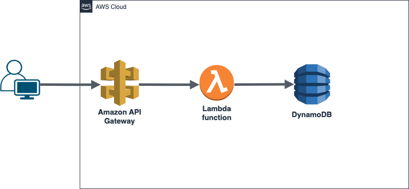

<br />
<div align="center">
  <h3 align="center">Project 1</h3>
  <p align="center">
    Server-less Web Application
    <br />
  </p>
</div>

<!-- ABOUT THE PROJECT -->

## Project Structure



<!-- GETTING STARTED -->

## Getting Started

### Create DynamoDB table

Partition key -> id (string)

Update _"dynamoDBtable"_ value in `configuration.json` and _"DYNAMODB_TABLE"_ in repl **SECRETS**.

### Look for LabRole ARN (Amazon Resource Names) and update the

`configuration.json`

### Install ServerLess framework

We need to install serverless framework.

```sh
npm install serverless
```

### Check `credentials.json` key value pairs and set yours in repl **SECRETS**.

## Deploy your function

Move to `/serverless-form` folder

```sh
cd ./serverless-form
```

Run

```sh
../node_modules/.bin/serverless deploy
```

## API Gateway

Create API **SumbitFormAPI**

### Create Method

Select **POST** and check the check mark

Integration Type: Lambda Function  
Use Lambda Proxy Integration: Checked (stores request data in `event`)  
Lambda region: Same region as Lambda function  
Lambda function: **serverlessForm**

### Enable CORS

Select the **POST** method  
Under **Actions** select **Enable CORS**  
Leave the default options and click on **Enable CORS and replace existing CORS headers**.  
Click **Yes, replace existing values**

### Deploy API

Under **Actions** select **Deploy API**  
Deployment stage: **[New stage]**  
Stage name: **prod**

Note the **Invoke URL** and update `form.js`.

## Host Static Page

### Version 1

Move to `/static-web` folder.

Run:

```python
python -m http.server
```

### Version 2

Use your S3 CLI script

### Version 3

Use serverless framework plugin
Run

```sh
npm install --save serverless-finch@latest
```

Run
move to `/serverless-form`

```sh
../node_modules/.bin/serverless client deploy
```
